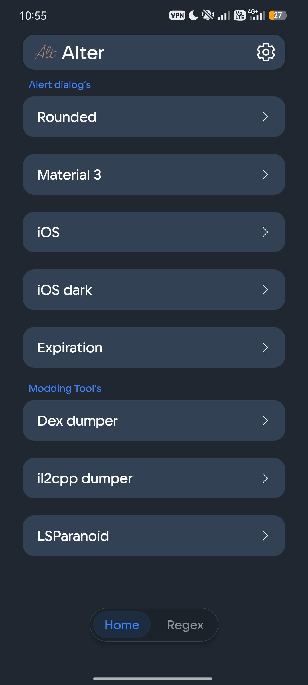
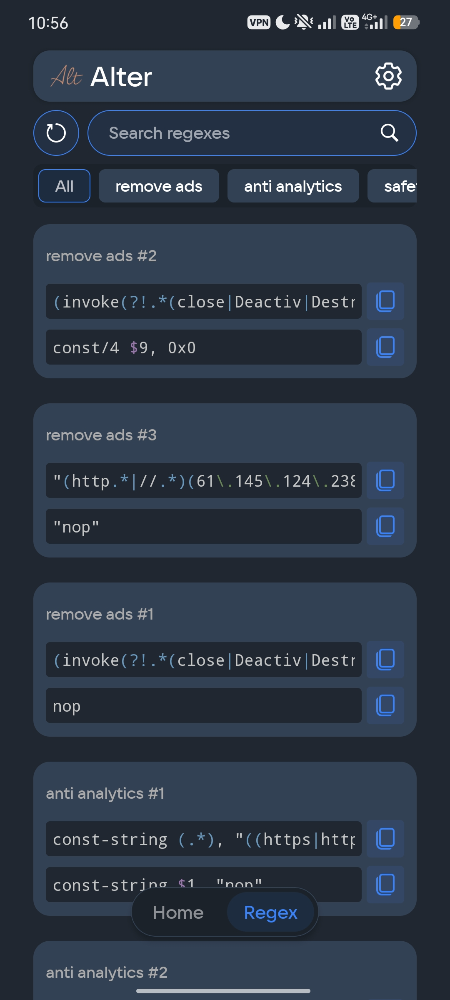
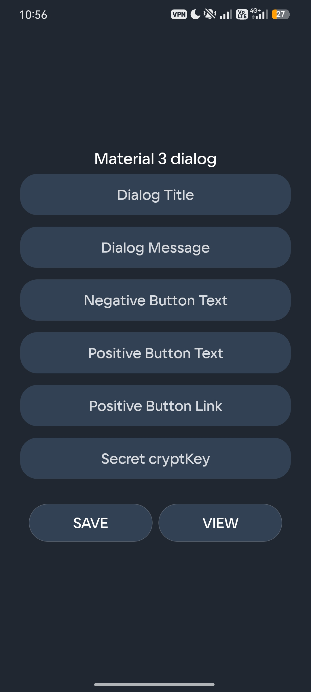
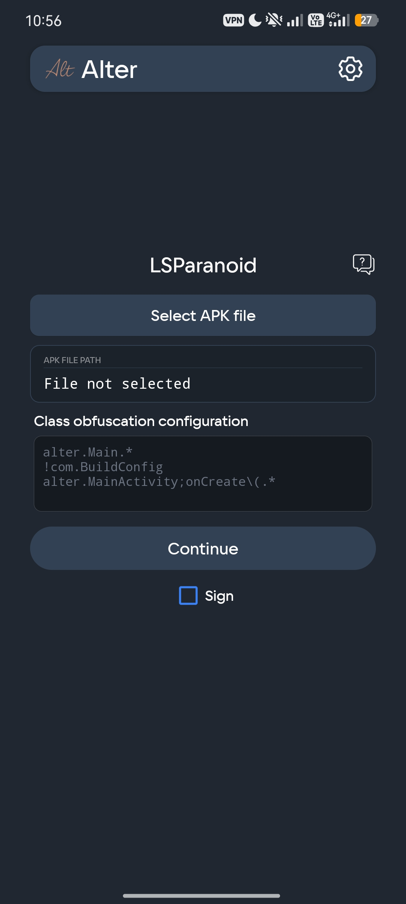
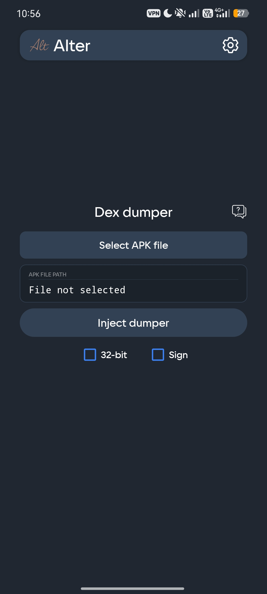

<div align="center">

[English](README.md) · **Русский**


# Alter

**Современный тулкит для моддинга Android: управление регулярками, генерация Smali-диалогов, внедрение дамперов в рантайме и обфускация строк в одном приложении.**

<br/>


[](https://github.com/Ivanparfenchuk/Alter/releases/latest)
[](https://github.com/Ivanparfenchuk/Alter/releases/latest)
[](https://t.me/AlterProject)
[](LICENSE)

</div>

<br/>

<div align="center">
  
  
  
  
  
</div>

---

## Обзор

Alter, приложение «всё в одном» для реверс-инженеров и моддеров, объединяет задачи, которые обычно приходится решать в разных инструментах: держать под рукой библиотеку регулярных выражений с поиском, генерировать готовый Smali для alert-диалогов, внедрять библиотеки-дамперы в APK и обфусцировать строковые литералы, всё в одном минималистичном интерфейсе. Работает на **Android 7.0+**, написано на **Java**, **root не требуется**.

## Возможности

### Менеджер регулярок

Отдельное рабочее пространство для регулярных выражений, которыми вы пользуетесь при моддинге. Вместо разрозненных заметок Alter даёт организованную библиотеку с поиском, которую можно переносить между устройствами.

- **Добавляйте свои паттерны:** собирайте библиотеку так, как удобно вам. Alter это не фиксированный список, а место для паттернов, которые собираете и оттачиваете именно *вы*.
- **Папки:** распределяйте коллекцию по именованным папкам под задачи (удаление рекламы, анти-аналитика, safety, freemium и т. д.).
- **Поиск, который не спешит:** поиск запускается по подтверждению запроса, поэтому список не перестраивается при каждом нажатии клавиши.
- **Бэкап и импорт:** экспортируйте всю коллекцию в `.zip` с `JSON`-файлами и восстанавливайте на любом устройстве.

> В отличие от инструментов, которые дают лишь пользоваться фиксированным набором заранее одобренных паттернов, Alter позволяет добавлять собственные регулярки, организовывать их и переносить куда угодно.

Подробнее: [docs/ru/features/regex-manager.md](docs/ru/features/regex-manager.md).

### Генератор Alert-диалогов

Генерируйте готовый **Smali**-код alert-диалогов в нескольких стилях (Rounded, Material 3, iOS, iOS Dark и Expiration) прямо из формы. Заполните заголовок, текст, кнопки и ссылку, посмотрите превью и скопируйте результат в свой проект.

- Несколько стилей диалогов из коробки.
- Встроенная **защита от подделки**: сгенерированные диалоги проверяют собственное состояние, поэтому их нельзя незаметно обойти правкой `SharedPreferences` приложения.

Подробнее: [docs/ru/features/alert-dialogs.md](docs/ru/features/alert-dialogs.md).

### Внедрение нативных дамперов

Внедряйте мощные библиотеки анализа в рантайме одним нажатием, без ручной правки `smali` и без сборочного окружения.

- **il2cpp dumper:** дампит классы, методы и поля IL2CPP из запущенного Unity-приложения.
- **dex dumper:** извлекает DEX-файлы из памяти запущенного приложения.
- Опции для **32-битных** целей и повторной **подписи** пропатченного APK.

Подробнее: [docs/ru/features/dumpers.md](docs/ru/features/dumpers.md).

### Порт LSParanoid

Порт **LSParanoid** для устройства, обфусцирующий литералы `const-string` внутри DEX-классов и заметно усложняющий статический анализ ваших строк. Укажите APK, опишите, какие классы обфусцировать, и продолжайте.

Подробнее: [docs/ru/features/lsparanoid.md](docs/ru/features/lsparanoid.md).

## Установка

**Требования:** Android 7.0 (API 24) или новее. Root не нужен.

1. Откройте страницу [**Releases**](https://github.com/Ivanparfenchuk/Alter/releases/latest).
2. Скачайте последний `Alter.apk`.
3. Установите (возможно, потребуется разрешить установку из браузера или файлового менеджера).

Последняя сборка всегда доступна по постоянной ссылке:

```
https://github.com/Ivanparfenchuk/Alter/releases/latest/download/Alter.apk
```

Релизы также выкладываются в Telegram-канале проекта: [t.me/AlterProject](https://t.me/AlterProject).

Пошаговое руководство: [docs/ru/INSTALLATION.md](docs/ru/INSTALLATION.md).

## Разрешения

Alter запрашивает только то, что нужно для чтения и записи APK-файлов и управления бэкапами регулярок. Каждое разрешение и причина его использования описаны в [docs/ru/PERMISSIONS.md](docs/ru/PERMISSIONS.md).

## Используемые компоненты

Alter включает следующие open-source компоненты. Полные атрибуции и тексты лицензий доступны в [docs/ru/CREDITS.md](docs/ru/CREDITS.md) и [docs/ru/THIRD_PARTY_LICENSES.md](docs/ru/THIRD_PARTY_LICENSES.md).

| Компонент | Автор | Лицензия |
| --- | --- | --- |
| [il2cppdumper](https://github.com/muhammadrizwan87/il2cppdumper) | MuhammadRizwan | MIT |
| [dexdumper](https://github.com/muhammadrizwan87/dexdumper) | MuhammadRizwan | MIT |
| [LSParanoid](https://github.com/LSPosed/LSParanoid) | LSPosed / Michael Rozumyanskiy | Apache-2.0 |

## Лицензия

Alter распространяется как **проприетарное ПО**, см. [LICENSE](LICENSE) (текст на английском как основной юридический язык).

Файлы, **сгенерированные** в Alter, покрываются отдельной разрешительной [лицензией на генерируемый контент](LICENSE-GENERATED-CONTENT.txt): их можно свободно использовать в личных и коммерческих проектах, а указание авторства требуется при распространении сгенерированного контента в составе библиотеки или пака шаблонов.

Встроенные сторонние компоненты остаются под своими лицензиями.

## Ссылки

- **Канал проекта:** [t.me/AlterProject](https://t.me/AlterProject)
- **Разработчик:** AvoluxModz ([t.me/AvoluxModz](https://t.me/AvoluxModz))

## Отказ от ответственности

Alter предназначен для исследований безопасности, обучения и модификации приложений, которыми вы владеете или которые вправе изменять. Вы несёте полную ответственность за использование инструмента и за соблюдение применимых законов и условий использования третьих сторон. Подробности и порядок обращений в [SECURITY.ru.md](SECURITY.ru.md).

<div align="center">
<br/>
<sub>© 2026 Alter · Разработано AvoluxModz</sub>
</div>
